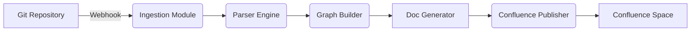

# AI-Powered Project Documentation Assistant

## 1. Project Definition

### 1.1 Background
Modern software projects span multiple services, APIs, and teams. Maintaining accurate, up-to-date documentation across codebases, design artifacts, and collaboration platforms (e.g., Confluence) is labor-intensive:

- **Fragmented Artifacts**: API references, UML diagrams, architecture docs scattered in repos, wiki pages, and spreadsheets.
- **Manual Overhead**: Engineers spend 10–15% of development time writing and updating docs.
- **Stale Content**: Outdated diagrams and missing endpoints lead to integration issues and delayed releases.

### 1.2 Purpose & Goal
Build an **AI-driven automation framework** that ingests code repositories and configuration, then:

1. **Analyzes** project structure, code comments, CI/CD pipelines, and infrastructure-as-code.
2. **Extracts** endpoints, class/module hierarchies, data models, and service interactions.
3. **Generates** comprehensive documentation:
   - API reference (OpenAPI/Swagger-derived)
   - Use Case Diagrams (actor–system interactions)
   - High-Level Design (HLD) with contextual grouping
   - Low-Level Design (LLD) with sequence and class diagrams
   - Architecture overview with deployment topology
4. **Publishes** markdown and UML assets to Confluence, structured in a hierarchical space.

### 1.3 Detailed Overview

#### 1.3.1 Architecture Components

- **Ingestion Module**: Listens to Git webhooks and CI/CD triggers; clones or fetches diff.
- **Parser Engine**: Language-specific parsers (Java, Python, JS) extract annotations, OpenAPI specs, GraphQL schemas.
- **Graph Builder**: Constructs an intermediate project graph; nodes represent services, classes, endpoints; edges represent calls and data flows.
- **Doc Generator**:
  - **API Generator**: Converts graph metadata into OpenAPI definitions and reference pages.
  - **UML Renderer**: Uses PlantUML to produce use case, class, sequence, and component diagrams.
  - **Page Composer**: Organizes documents into sections (Overview, API, Diagrams, Data Models).
- **Confluence Publisher**:
  - Authenticates via OAuth.
  - Creates/updates pages under a root space with page tree template.
  - Attaches UML images and markdown via Confluence REST API.

#### 1.3.2 Data Flow

#### 1.3.3 Technology Stack

| Layer               | Technology                             |
|---------------------|----------------------------------------|
| Ingestion           | Node.js, Python, GitHub/GitLab Webhooks|
| Parsing             | ANTLR, AST libraries, Swagger Parser   |
| Graph Processing    | Neo4j, NetworkX                        |
| Diagram Rendering   | PlantUML, Graphviz                     |
| Documentation       | Markdown, REST API, Confluence SDK     |
| Infrastructure      | Docker, Kubernetes, AWS/GCP            |

## 2. Expected Outcomes

### 2.1 Target Users
- **Software Developers**: Instant API docs and diagrams.
- **Technical Writers**: Structured content templates.
- **QA Engineers**: Clear endpoint definitions and test flow.
- **DevOps Teams**: Deployment topology diagrams.
- **Product Managers**: High-level architecture overviews.

### 2.2 Expected Benefits
1. **Accelerated Delivery**: Reduce release cycle time by 20% by eliminating manual doc tasks.
2. **Improved Quality**: Align code and docs; minimize integration defects.
3. **Onboarding Efficiency**: New hires ramp up 30% faster with up-to-date docs.
4. **Audit & Compliance**: Track change history of docs; generate audit reports.

## 3. Scalability & Extensibility

- **Modular Plugins**: Add parsers for new languages or frameworks via plugin interface.
- **Horizontal Scaling**: Stateless microservices behind API gateway; autoscaling on Kubernetes.
- **Event-Driven**: Integrate with Kafka or AWS SNS/SQS to handle bursts of repository events.
- **Multi-Tenant**: Namespaced Confluence spaces; RBAC controls per team.

## 4. Additional Use Cases

1. **Compliance Reporting**: Map data flows to regulatory requirements; auto-generate compliance docs.
2. **Release Notes Composer**: Aggregate changelogs and diffs to produce formatted release notes.
3. **Security Insights**: Embed SAST/DAST findings into architecture docs with remediation guidance.
4. **Dependency Visualization**: Interactive service dependency maps for microservices.
5. **Knowledge Graph**: Build a searchable graph of classes, methods, and diagrams.
6. **Automated Glossary & Ontology**: Extract domain terms and definitions, update glossary pages.
7. **ChatOps Integration**: Query documentation via chatbots in Slack/MS Teams.

